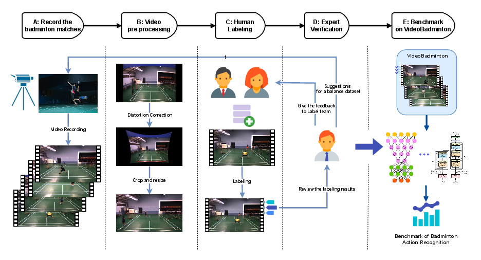

# VideoBadminton

Qi Li <sup>1</sup>, Tzu-Chen Chiu <sup>2</sup>, Hsiang-Wei Huang <sup>2</sup>, Min-Te Sun<sup>2</sup>, Wei-Shinn Ku <sup>1</sup>

<sup>1</sup> Auburn University Auburn, United States, 
<sup>2</sup> National Central University Taoyuan City, Taiwan



### Dataset

Our dataset is available at [VideoBadminton](https://drive.google.com/file/d/1KW5Q8Hd8-J75FdnehMjHw1WvdXDv1UxB/view?usp=sharing).


### ModelZoo

| Methods    | Backbone     | Top1 Acc | Top5 Acc | Mean Cls Acc | Models trained on VideoBadminton |
|------------|--------------|----------|----------|--------------|--------------| 
| R(2+1)D| ResNet2Plus1d| 79.53%   | 96.11%   | 66.97%       | [R(2+1)D]()|
| SlowFast| ResNet3dSlowFast| 82.80%   | 97.54%   | 73.80%       | [SlowFast]()|
| TimeSformer| TimeSformer| 73.18% | 94.78%   | 57.70%       |[TimeSformer]() |
| Swim   | SwinTransformer3D| 81.99%   | 96.52%   | 69.93%       | [Swim]()|
| MViT-V2| MViT | 14.23%   | 62.23%   | 10.76%       |[MViT-V2]() |
| ST-GCN | RecognizerGCN| 74.41%   | 93.76%   | 61.44%       | [ST-GCN]()|
| PoseC3D | Recognizer3D| 80.76%   | 96.01%   | 67.18%       | [PoseC3D]()|

#### Notes:
1. The train and validation sets are split as follows:

  *  [Badminton Train split]()

  *  [Badminton Validation split]()

2. 


### Citation

```

```


